# Discord Tags

> Auto-generated from ATMTagIndexer. Images live in the `images/` folder.

## Guides

!!! note "ae2guide"
    ## All The AE2  Guides
    ### Official AE2 Guide
    <https://guide.appliedenergistics.org/1.21/index>
    ### All The Guides AE2 Guide
    <https://allthemods.github.io/alltheguides/mods/ae2/>
    ### Youtube Guides
    [**AE2 Guide Video by BucketSt**](<https://www.youtube.com/watch?v=3htUhkDYbJ8>)
    [**AE2 Guide Playlist by The MindCrafters**](<https://www.youtube.com/playlist?list=PLz9AkOmMlH1lI4H3GeBQ3VzEKlcDDNO8_>)
    [**AdvancedAE Guide by The MindCrafters**](<https://www.youtube.com/watch?v=2_s1srWvq20>)

!!! note "allthemodium"
    **Where to find Allthemodium:**

    ATM8/9/10/11: Deep Dark.
    ATM7: Mountains.
    ATM7TTS: Twilight Forest Hollow Hills.

!!! note "apoth"
    **[ATM9 Apotheosis Guide](https://allthemods.github.io/alltheguides/atm9/apotheosis/)**
    **[ATM10 Apothic Enchanting Guide](https://allthemods.github.io/alltheguides/atm10/apothicenchanting/)**

!!! note "apotheosis"
    **[ATM9 Apotheosis Guide](https://allthemods.github.io/alltheguides/atm9/apotheosis/)**
    **[ATM10 Apothic Enchanting Guide](https://allthemods.github.io/alltheguides/atm10/apothicenchanting/)**

!!! note "apothfilter"
    ## Apotheosis Filter Tags for Pipez
    ***Disclaimer*: Use Pipez in moderation since it's TPS heavy!**
    **All Apotheosis Gear (paste this in the "NBT Data" field):**
    ```json
    {"apotheosis:affixes":{}}
    ```
    **Specific Gear Rarities (paste one of these in the "NBT Data" field):**
    ```json
    {"apotheosis:rarity":"apotheosis:mythic"}
    {"apotheosis:rarity":"apotheosis:epic"}
    {"apotheosis:rarity":"apotheosis:rare"}
    {"apotheosis:rarity":"apotheosis:uncommon"}
    {"apotheosis:rarity":"apotheosis:common"}
    ```
    **All Gem Purity (paste this in the "Item/Tag" field):**
    ```json
    apotheosis:gem
    ```
    **Specific Gem Purities (paste one of these in the "NBT Data" field):**
    ```json
    {"apotheosis:purity":"perfect"}
    {"apotheosis:purity":"flawless"}
    {"apotheosis:purity":"normal"}
    {"apotheosis:purity":"flawed"}
    {"apotheosis:purity":"chipped"}
    {"apotheosis:purity":"cracked"}
    ```

!!! note "bedrockbreaker"
    https://www.youtube.com/watch?v=Zw6PcJ755og

!!! note "beefilter"
    [List of NBT filter examples for Productive Bees genes](https://discord.com/channels/254530689225981953/1236826820200894496/1545877044020379802)

!!! note "beeprogression"
    ## Best bee upgrades at each stage:
    - **4x** Speed 
    - **1x** Simulator & **3x** Speed 
    - **1x** Simulator & **3x** Alpha Productivity
    - **1x** Simulator & **3x **Beta Productivity
    - **1x** Block Upgrade & **3x** Gamma Productivity
    - **4x** Omega Productivity

    ### Notes:

    - **Gamma Upgrades also count as Simulator!**
    - **Omega Upgrades also count as Simulator & Block Upgrade!**
    -  The **Block Upgrade** turns combs into blocks at a 1:1 ratio (40 blocks instead of 40 combs)
    - To process **Comb Blocks** you need **Heated Centrifuges!**
    - If you have nether stars before Omega Upgrades, replace a Productivity Upgrade with a Block Upgrade to almost quadruple your output!

!!! note "beeupgrader"
    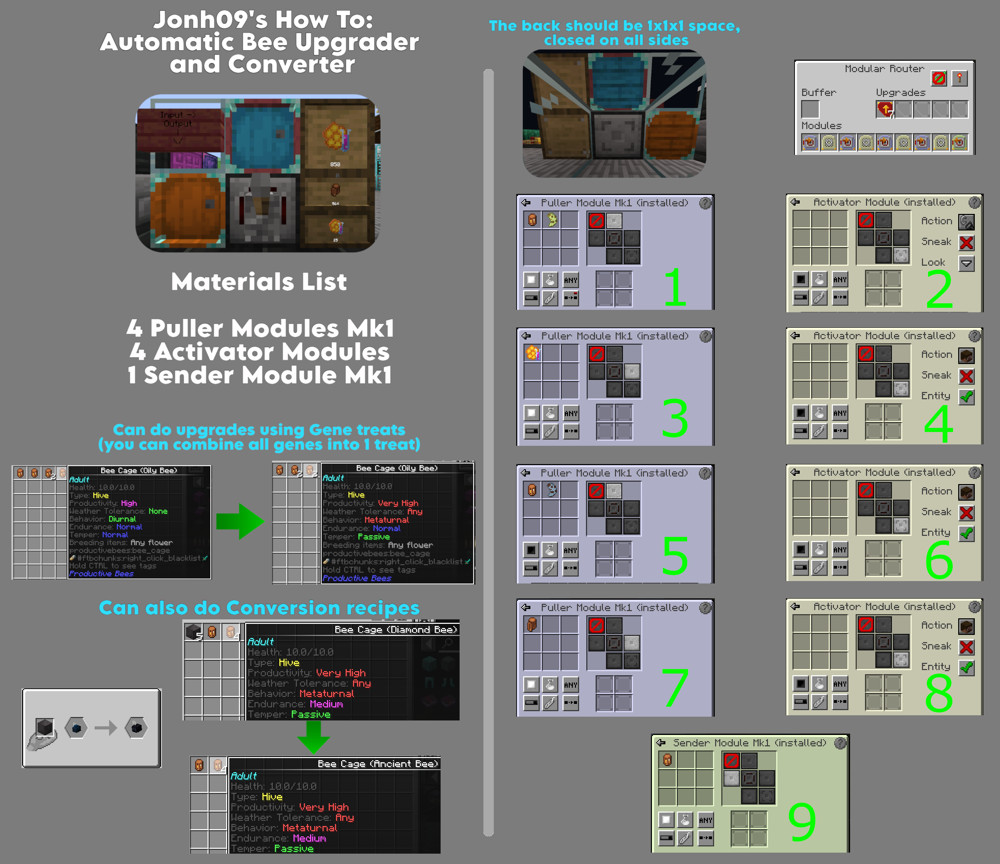

!!! note "brmoderators"
    [Moderators for `Bigger Reactors` mod](https://biggerseries.net/biggerreactors/reactor/moderators)

!!! note "bulkcells"
    [**MEGA Bulkcells**](https://allthemods.github.io/alltheguides/mods/ae2/bulkcells/bulkwhat/)

!!! note "cobblemonspawns"
    ## Information on all spawns:

    **(CHECK THIS FIRST)** [Base Cobblemon Spawns](<https://www.cobbledex.info/>)

    [Mega Showdown Spawns](<https://megashowdown.miraheze.org/wiki/Included_Pokémon>)

    **(CHECK THIS SECOND)** [Complete Cobblemon Collection - Pokemon Spawns (As of 0.13)](<https://github.com/Complete-Cobblemon-Collection-Team/resourcepack/blob/2.1/main/data/cobblemon/spawn_pool_world>) - Anything that doesn't spawn in base cobblemon is spawned by this mod. (Excluding legendaries/mythicals/paradox/UBs).

    [Raid Den Bosses](<https://github.com/necro50n3/cobblemon-raiddens/tree/master/common/src/main/resources/data/cobblemonraiddens/raid/boss>)

    [For Greavard/Houndstone spawns, and roaming legendaries](<https://github.com/AllTheMods/All-the-Mons/tree/main/kubejs/data/cobblemon/spawn_pool_world>)

    [Legendary Monuments](<https://legendarymonuments.com/>)

!!! note "compact"
    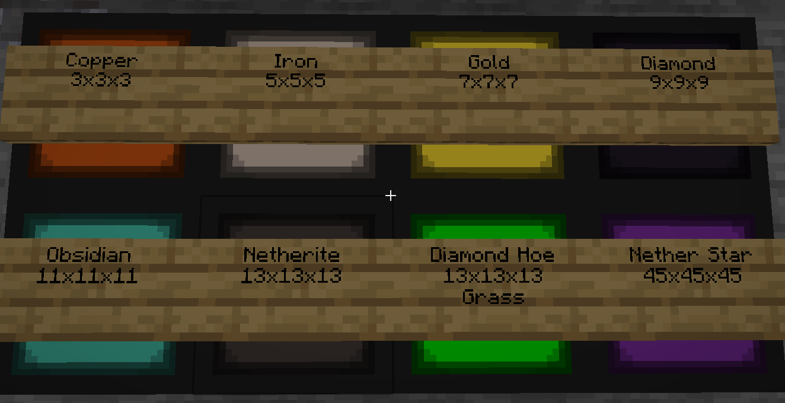 {embed}

!!! note "disenchant"
    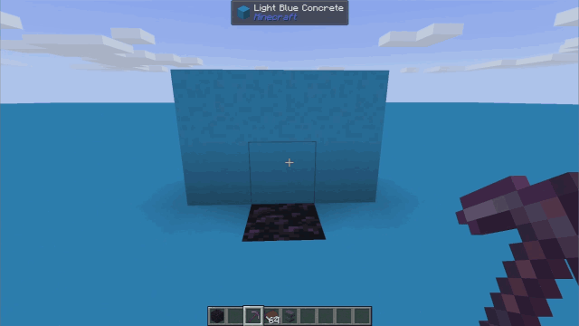

!!! note "dragons"
    **Dragons are found in the 'The Other' dimension, you can get there by using a Teleport Pad in the Nether.**
    __Fire dragons__ spawn in basalt deltas biome and make Vibranium-Allthemodium alloy.
    __Ice dragons__ spawn in mountain biome and make Unobtainium-Vibranium alloy.
    __Lightning dragons__ spawn in desert biome and make Allthemodium-Unobtainium alloy.
    __Tier 4 and 5 dragons__ can only be found underground.

!!! note "extractor"
    **Infinity Grain not working?** You need Fire underneath / above the obsidian, which wont render in JEI
    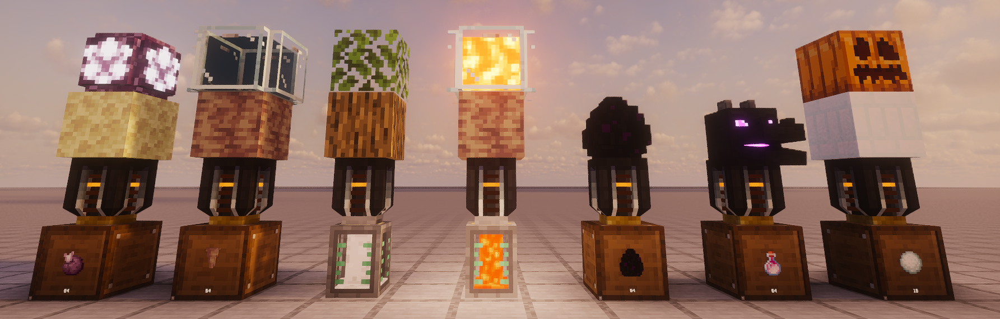

!!! note "jei"
    ## All JEI Search Prefixes
    - **Prefix `@`**: Search by Mod ID
    - **Prefix `#`**: Search by Tag 
    - **Prefix `$`**: Search by Tooltip (Won't search anything that requires Shift to be pressed)
    - **Prefix `&`**: Search by Resources Location *[Needs to be enabled in the config!]*
    - **Prefix `%`**: Search by creative tab name *[Needs to be enabled in the config!]*
    - **Prefix `^`**: Search by color *[Needs to be enabled in the config & will also increase Ram usage!]*

!!! note "l2traits"
    https://allthemods.github.io/alltheguides/atma/l2hostility/#specific-l2-trait-whitelists

!!! note "lava"
    ### Methods to generate infinite lava in ATM10
    1. **Fluid Drawer** (Functional Storage)
      - Make Dripping upgrades.
      - Right click the  fluid drawer with said Upgrades.
    2. **Extractor** (Xycraft)
      - Check JEI for the structure.
      - `?extractor` will also provide you with the setup.
    3. **Fire Seeds** (Mystical Agriculture)
      - Use the essence and combine it with a bucket in any crafting grid.
      - This will make a lava bucket.
    4. **Lava Bee** (Productive Bees)
    ### Methods to get lava which are technically not infinite.
    1. **Electric Pump** (Mekanism)
      - Go drain all the lava in the Nether.
    2. **Ranged Pumps**
      - Drain even more lava from the Nether.
    3. **Hose Pulley** (Create)
      - Drain all the lava?
      - if you have a pool with more than **10 000 source blocks** this method will create **infinite lava!**
    ### The best method.
    1. **Infinite Lava Cell** (ExtendedAE + KubeJS)
      - Put it in your ME Drive to have infinite lava available in your ME System.

!!! note "ma"
    **Ways to farm Mystical Agriculture seeds in ATM10**

    __Currently available options: __
    - Early to late game AE2 growth accelerators: <https://youtu.be/RNZMrZ_sEs4> 
    - Lilypad of fertility from Reliquary
    - Immersive Engineering Cloche
    - Botany Pots - can be boosted with Essence Farmland (more for early game)
    - Industrial Foregoing Hydroponic Beds: <video controls src="images/ma.mp4"></video>
    - Industrial Foregoing **Simulated** Hydroponic Beds:
    <https://www.youtube.com/watch?v=URnd8RhxKTI>

!!! note "maxenchanting"
    For max level enchants from the enchanting table, you can use the below shelves
    1.21: ```
    5x Echoing Sculkshelf
    5x Soul-Touched Sculkshelf
    1x Deepshelf of Arcane Treasures
    1x Draconic Endshelf
    1x Geode-Encased Bookcase of Stability
    ```
    1.19-1.20
    ```
    3 x End-Fused rectification
    1 x Draconic Endshelf
    5 x Soul Touched Sculkshelves
    5 x Echoing Sculkshelves```
    1.18 and below,
    ```
    3 - Endshelf
    3 - Draconic Endshelf
    12 - Pearlescent Endshelf
    2  - Wither  Skulls
    2x - Shelf of Masterful Sight
    5x - Shelf of End Fused Rectification (20%)
      Rectification - 100%
    ```

!!! note "mekalloyguide"
    {embed} 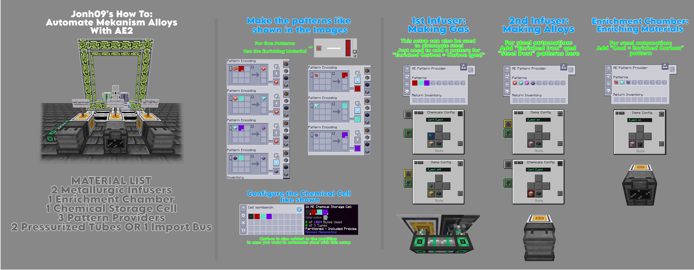

!!! note "mekrebalance"
    https://github.com/AllTheMods/ATM-10/blob/main/kubejs/server_scripts/mods/Mekanism/Rebalance/rebalance.md

!!! note "miguide"
    ## All The Modern Industrialization Guides
    ### Youtube Guides
    [**ATM10 Specific MI Guide by Pilpoh**](<https://www.youtube.com/watch?v=G6W41fduSpg>)
    [**MI Beginners Guide (Full Steam Age) by JaviHerobrine**](<https://www.youtube.com/watch?v=Y2d8NLX-e4I>)
    [**MI Ultimate Guide (Entire Mod) by JaviHerobrine**](<https://www.youtube.com/watch?v=MBSuaKdfNIs>)

!!! note "modium"
    **Where to find Allthemodium:**

    ATM8 and newer: Deep Dark.
    ATM7: Mountains.
    ATM7TTS: Twilight Forest Hollow Hills.

!!! note "monspawns"
    ## Information on all spawns:

    **(CHECK THIS FIRST)** [Base Cobblemon Spawns](<https://www.cobbledex.info/>)

    [Mega Showdown Spawns](<https://megashowdown.miraheze.org/wiki/Included_Pokémon>)

    **(CHECK THIS SECOND)** [Complete Cobblemon Collection - Pokemon Spawns (As of 0.13)](<https://github.com/Complete-Cobblemon-Collection-Team/resourcepack/blob/2.1/main/data/cobblemon/spawn_pool_world>) - Anything that doesn't spawn in base cobblemon is spawned by this mod. (Excluding legendaries/mythicals/paradox/UBs).

    [Raid Den Bosses](<https://github.com/necro50n3/cobblemon-raiddens/tree/master/common/src/main/resources/data/cobblemonraiddens/raid/boss>)

    [For Greavard/Houndstone spawns, and roaming legendaries](<https://github.com/AllTheMods/All-the-Mons/tree/main/kubejs/data/cobblemon/spawn_pool_world>)

    [Legendary Monuments](<https://legendarymonuments.com/>)

!!! note "morgan"
    {del} In order to make the morgan in ATM9 (and no frills) you have to kill the warden with the caliburn. Read all the changes in ATM9 for Mahou [on our wiki](<https://allthemods.github.io/alltheguides/atm9/mahoutsukai/>).

!!! note "ores10"
    **ATM10 Ore Generation**
    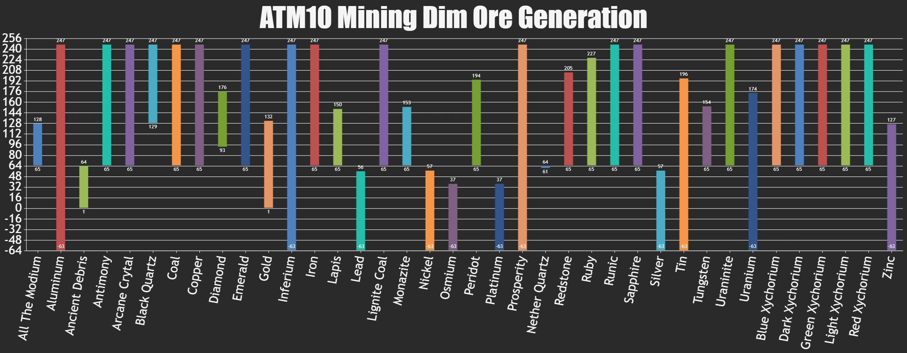
    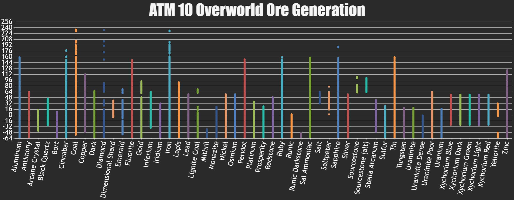

!!! note "pickupmobs"
    **Some ways to pick up mobs in ATM10**
    1. `Creature Catcher` from JustDireThings
    2. `Quantum Catcher` from Forbidden Arcanus
    3. `Mob Imprisonment Tool` from Industrial Foregoing

!!! note "piglichu"
    

!!! note "prodbees"
    ### All The Bee Guides

    [**Pilpoh's Video Guide**](<https://www.youtube.com/watch?v=zweptwn7288>)
    [**Kaimonick's Quick Visual Guide**](<https://allthemods.github.io/alltheguides/mods/kaimonickguides/#productive-bees>)
    [**Jonh's Genes Guide**](<https://allthemods.github.io/alltheguides/atm9/productivebees>)

!!! note "rs2ae"
    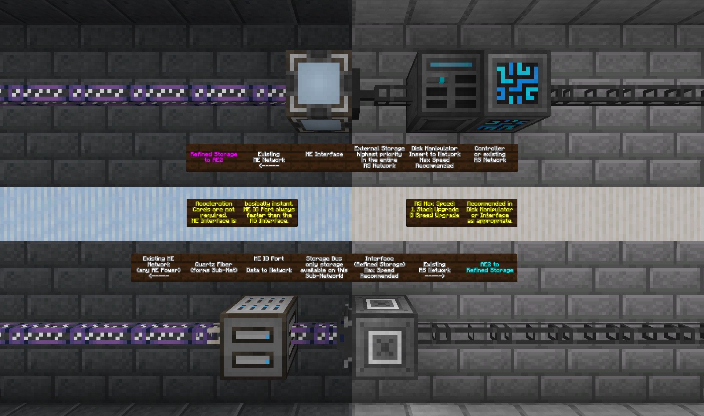

!!! note "rsguide"
    ## All The RS Guides
    ### Official RS Guide
    [RS Wiki](https://refinedmods.com/refined-storage/index.html)
    ### Videos
    [Full Guide - Video](<https://www.youtube.com/watch?v=bdXXtviNABQ>)
    [1.21+ / RS2 changes](<https://www.youtube.com/watch?v=CJtzy_wMTYk>)

!!! note "sathroller"
    https://allthemods.github.io/alltheguides/mods/ae2/setups/controller/

!!! note "sfm"
    ## [Super Factory Manager (SFM) Discord](<https://discord.gg/xZ98rU9EvH>)
    ## [Basic Text Guide](<https://docs.google.com/document/d/1QhPESCN4kPflme28_W0jVQRnvyrXXs9ZUxBTLhloCbg/edit?tab=t.0#heading=h.bmv5wvth83jd>)
    <video controls src="images/sfm.mov"></video>

!!! note "sgear"
    ### Silent Gear Guides
    [**ATM6 GitHub Wiki**](<https://github.com/AllTheMods/ATM-6/wiki/SGear-and-Tinkers>)
    [**ATM10 Google docs spreadsheet**](<https://docs.google.com/spreadsheets/d/1_4j0YHBde5CYI3lXYyTmyDGwScMcWlhBKOCaKxHqJLk/edit?usp=sharing>)

!!! note "sgearworks"
    **ATM10 2.46+:** [Silent Gear Metalworks](<https://www.curseforge.com/minecraft/mc-mods/silent-gear-metalworks/files/6362526>)
    > 
    > This mod adds compatibility between Silent Gear and Productive Metalworks by modifying the gear recipes to use the Metalworks Foundry multiblock casting recipes for all metal or other meltable resources.
    > 
    > * Gear part recipes can no longer use meltable resources when in a crafting grid
    > * Metal gear parts must be cast in a foundry
    > * Adds Meat material
    > * Blueprint models have been changed to casts

!!! note "slab"
    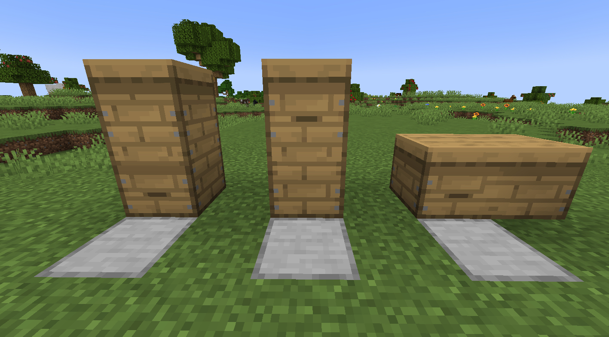

!!! note "soulsrebalance"
    ## [Industrial Foregoing Souls Rebalancing](<https://github.com/AllTheMods/ATM-10/pull/2923>)

!!! note "templates"
    **AllTheModium Template**
    Found in `Suspicious Clay` inside `Ancient Cities`
    **Vibranium Template**
    Found in `Suspicious Soul` Sand inside `Treasure Bastions`
    **Unobtainium Template**
    Obtained after defeating all mobs from the `Trial Spawner` in the `library room of the Dungeon` within `The Other`

!!! note "timecrystaltut"
    https://m.youtube.com/watch?v=phsjFbUs7gw

!!! note "vanillamobs"
    Vanilla farm animals do not spawn in ATMons, they are replaced by their equivalent mons. The mons drop the same stuff as vanilla animals so you can farm them for leather etc. The market from farmingforblockheads has spawn eggs you can buy if you require the vanilla animals. If you don't like this change you can disable it in `config/allthemons-common.toml`

!!! note "voidcell"
    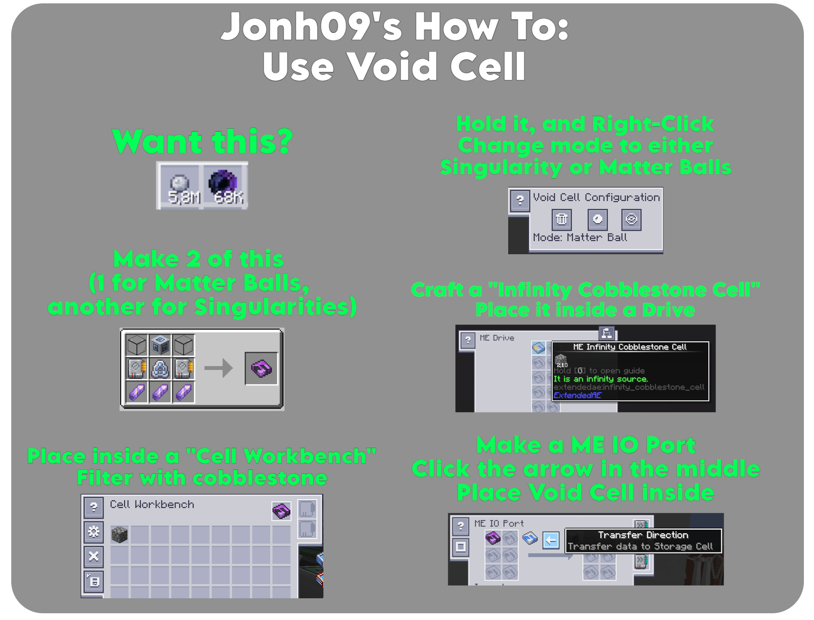

    **Singularity / Matter ball production speed is tied to how much energy your system has available as buffer** (need Energy Cells - Superdense being the best -, to increase it).
    __For faster production, use a Extended ME IO Port instead__ (high energy consumption tho, MFE level).

    Another **simpler way** of producing singularities / matter balls is using the base **Matter Condenser + Pattern Provider.**
    (also needs large energy buffer, more requested at once = more energy needed)
    [Pattern Provider way](https://discord.com/channels/254530689225981953/1242640462217613313/1247489389685379083)

!!! note "voidminer"
    Guide to Environmental Tech void miners, by Xarrah: <https://docs.google.com/spreadsheets/d/1MrtrIbYffBIZVgGy1Oy8NrEdXVStueMCj5C7ObY6bzc/edit#gid=0>

!!! note "water"
    https://allthemods.github.io/alltheguides/mods/integrateddynamics/infinitefluidtransfer/

!!! note "worldtiers"
    ### Apotheosis World Tiers in ATM10
    - Progress can be checked in the **Advancements** (default `L` or in the esc menu) after you found your first **Affix Item**.
    - After reaching a new World Tier you will have to active it in a new menu (default `Ctrl + T`).
    - Increasing your world tier means better quality gem and gear drops but will also improve enemy stats!
    - Invaders are what used to be known as Bosses, they will make a sound when spawning and be highlighted by a beacon-like effect and feature a coloured outline that is visible through walls.

## Information

!!! note "10faq"
    https://discord.com/channels/254530689225981953/1382769223146799314

!!! note "9faq"
    https://allthemods.github.io/alltheguides/atm9/faq/

!!! note "9v10"
    https://www.modpackindex.com/modpacks/compare?modpacks=64056,85233

!!! note "9vnf"
    [Here](<https://www.modpackindex.com/modpacks/compare?modpacks=64056,74905>) is a comparison between ATM9 and ATM9: No Frills

!!! note "about"
    This server is about our AllTheMods **Modpacks** for the **JAVA** version of Minecraft.
    <https://www.curseforge.com/members/atmteam/projects>

!!! note "akliz"
    {del}**Create Your Own Paid Server**
    https://www.akliz.net/allthemods

!!! note "amp"
    https://allthemods.github.io/alltheguides/help/server/amp/

!!! note "arcanafaq"
    https://discord.com/channels/254530689225981953/1352358730590589062

!!! note "ask"
    # How do I ask a good question?

    `1. Search and Research`
    Before posting a question, *please* spend a reasonable amount of time researching the problem and searching for existing questions on the internet that may provide an answer.

    `2. Don't ask to ask, just ask`
    Someone is unlikely to answer to your "asking to ask" question, but an actual description may pique their interest and get them to answer.

    `3. Don't just say "I'm crashing" or "Why am I crashing?"`
    That is *BEYOND* useless. Do `?logs` and **READ IT CAREFULLY**. Then post your logs and describe your problem in as much detail as you can.
    <https://dontasktoask.com/>

!!! note "atg"
    **All The Guides:**
    https://allthemods.github.io/alltheguides

!!! note "auth"
    {del} https://downdetector.com/status/minecraft/

!!! note "beta"
    The pack is in beta, new features/changes are being worked on as we speak. Be patient.

!!! note "bruce"
    https://github.com/brucethemoose/Minecraft-Performance-Flags-Benchmarks

!!! note "cf"
    Join CF discord here: https://discord.com/invite/curseforge

!!! note "context"
    **Please Provide some context to help us help you**
    __Basic Troubleshoot__
    Try launching the game/joining world/server again. Could be a one-time thing.
    Try restarting your computer and do the step above again.

    __Context__
    - Does this happen if you try to launch/join again? Or one time crash?
    - Is this your first time installing this pack?
    - Did this happen right after updating?
    - Was this while launching, while joining world or while playing?
    - *If while playing*, do you remember what you were doing specifically?
    - What launcher are you using if not Curseforge?

!!! note "darkmode"
    [**AE2 Darkmode Texturepack**](<https://www.curseforge.com/minecraft/texture-packs/ae2-dark-mode>)

!!! note "dcint"
    Typically we use either of these two mods for integration between discord and server chat: 
    <https://www.curseforge.com/minecraft/mc-mods/dcintegration> 
    <https://www.curseforge.com/minecraft/mc-mods/simple-discord-link-bot-forge-fabric-spigot>

!!! note "e4mc"
    https://www.curseforge.com/minecraft/mc-mods/e4mc

!!! note "extrachunks"
    Modifiy **Claim Chunks** Count
    ```
    /ftbchunks admin extra_claim_chunks <player> <set/add> <amount>
    ```
    Modify **Force Loaded Chunks** Count
    ```
    /ftbchunks admin extra_force_load_chunks <player> <set/add> <amount>
    ```

!!! note "fakeplayers"
    **__How to enable Fake Players in your claims__**
    If you dont know how to claim, send `?ftbchunks` in <#1205155299430760538> , and the bot will teach you how.
    {embed}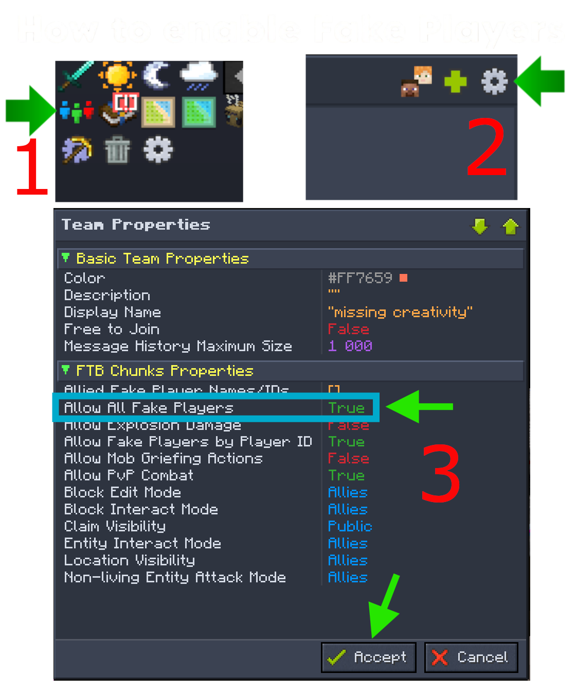

!!! note "ftbchunks"
    ## FTBChunks Guide (refer to image after for visual result)
    ### Claiming Chunks:
    - Press `M` to open the **FTBChunks map**
    - Press `C` (or the button on top left) to open the **Claim Chunks map**
    - `Left-Click` the chunks you want to claim
    *Claimed Chunks will be tinted in your Teams color*
    ### Forceloading Chunks:
    - Follow the above steps
    - `Shift + Left-Click` the chunks you want to forceload 
    *Forceloaded chunks will have a line pattern on them compared to claimed chunks*

    ### Increase number of Claims/Forceloads:
    - Type `?extrachunks` in the discord chat
     
    ### To keep chunks loaded even when players are offline:
    - Type  `?ftbchunksserver`  in the discord chat

    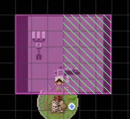

!!! note "ftbchunksserver"
    ## Keep chunks loaded even when players are offline - 2 Methods
    __**Ingame (need OP / admin)**__
    1. Open Inventory and click the`Claim Manager` button
    2. Click the `Server Settings` button (Purple Cogwheel)
    3. Scroll down to `Force-Loading`
    4. Change `Offline Forceloading Mode` set to `Always`

    __**Via Config**__
    1. **Stop the Server!** - The Config wont be saved if the Server is running
    2. **Find the config** - 
    __1.21.1+ (ATM10 and newer): __
    -> `<server>/config/ftbchunks-world.snbt` 
    __1.20- (ATM9 and older):__
    -> `<server>/world/serverconfig/ftbchunks-world.snbt`

    3: **Edit the setting** - `force_load_mode: default` to `force_load_mode: always`
    4: **Save!!!** - If you don't save it won't work

    __**Note**__: 
    ```diff
    - Sometimes you may need to Unclaim, and Claim + Forceload the chunks again for it to work.
    ```

!!! note "ftblibrary"
    ## FTB Library Vulnerability - Critical
    If you host public servers, please update the FTB Library mod to latest, it is only required on the server side, so players will not need to do anything.
    1.20.1 (Affected packs: Gravitas 2, ATM9, ATM9 Sky) - [FTBLibrary 2001.2.13](<https://www.curseforge.com/minecraft/mc-mods/ftb-library-forge/files/8226927>)
    1.21.1 (Affected packs: ATM10, ATM10 Sky, ATM10 Lite, AllTheMons) - [FTBLibrary 2101.1.32](<https://www.curseforge.com/minecraft/mc-mods/ftb-library-forge/files/8226923>)

!!! note "general"
    {del} If you require general gameplay support for an ATM pack, please ask your question in one of the following channels that corresponds to the pack you are playing:
    https://discord.com/channels/254530689225981953/1493806266194067607
    <#1426381526869737552> 
    <#1236826820200894496>
    <#1405575468748640429>
    <#1350269082661949460>
    <#1453258895626862756>
    <#1202017293371199558>
    <#1242640462217613313>
    <#1202017358890414130>
    <#1202016703446253680>
    <#1202056735322554388>
    <#1205296436967907478>
    <#1202051156625592400>
    <#1205297490845376542>
    <#1202048979802800179>
    <#1202056043136553070>

    The techsupport channels are for technical help such as game crashes; these general channels should be used for gameplay related help.

!!! note "github"
    https://github.com/AllTheMods/

!!! note "google"
    {del}
    {=(link1):https://}
    {=(link2):googlethatforyou.com/?q=}
    {=(link3):{join(%20):{args}}}
    Let me google that for you: <{link1}{link2}{link3}>

!!! note "help"
    **READ THIS IN ITS ENTIRETY**

    * Did you allocate ram only in the CurseForge launcher?
    * Are you using essentials? Use the mod [**e4mc**](<https://www.curseforge.com/minecraft/mc-mods/e4mc>) instead, we don't suport essentials.
    * Is it a gameplay question? Ask in ⁠"modpack"-general channel
    * Have lag? type `?lag` and read it.
    * Cant post image in this chat? type `?imgur` and read it.
    * Need to share a log? type `?ca` and read ALL OF IT (or in older packs, `?logs`!
    * Exit code 1? type `?ex1` and read it.
    * Installing a server and it won't start? Did you install the correct java? Type `?java` and read it.
    * Need help installing or updating a server? type `?server` and read it carefully

!!! note "howargs"
    <video controls src="images/howargs.mp4"></video>

!!! note "hytale"
    Currently we are still exploring **Hytale**'s potential.
    For the moment we only plan on having a sort of "modpack" for [Akliz ](<https://www.akliz.net/games/hytale>) users to easily set up a modded **Hytale** server (Other server hosts are welcome to copy the mod list to host themselves).

    ATM Mods are only a possibility for now, no guarantees.

    We have a Supporter's Hytale server live right now if you are interested.
    <#1461145313808089190> 

    **Note**: When Hytale modpacks become a thing, we will release what we have. And if people like it we will continue updating it.

!!! note "imgur"
    Upload the image you’d like to post to [Imgur](<http://imgur.com/upload>) and post the link here afterwards.
    -
    If you are in the UK, Imgur is not available, try using this as an alternative: [Imgbb](<https://imgbb.com/>)
    -
    ```Be active, get a Supporter rank, or Boost the server to allow you to post pictures directly!```

!!! note "invite"
    {del}discord.gg/allthemods

!!! note "java"
    {del} https://allthemods.github.io/alltheguides/help/java/

!!! note "launchers"
    **Launchers with access to the CurseForge API:**
    ### **First party:** 
    (official, fully supported, gets all mods)
    [**Curseforge App**](<https://www.curseforge.com/download/app#download-options>) - Make sure to get the standalone version, 
    [**FTB app**](<https://www.feed-the-beast.com/ftb-app>)
    ### **Third Party:** 
    (unofficial, might lead to issues, some mods have 3rd party Downloads turned Off, the launchers will usually inform you of this) 
    [**PrismLauncher**](<https://prismlauncher.org/>)
    [**ATLauncher**](<https://atlauncher.com/downloads>)

!!! note "learnjs"
    [Learn JavaScript](<https://www.codecademy.com/resources/docs/javascript>)
    [KubeJS wiki](<https://kubejs.com/>)

!!! note "license"
    https://allthemods.github.io/alltheguides/about/license/

!!! note "markdown"
    https://www.markdownguide.org/cheat-sheet/

!!! note "merch"
    {del}[Our Merch](https://www.bonfire.com/store/all-the-mods/)

!!! note "metric"
    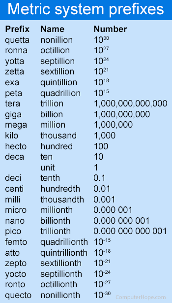

!!! note "modlist"
    ## For Curseforge
    Modpacks you install from Curseforge have a `manifest.json` file which lists all the **direct download** URLs. It's a bit cluttered with the names hiding in the URLs, but still a viable option. It's found in the modpack folder.

    ## Modpack specific option
    Some Modpacks, like the ATM Modpacks, also have a `modlist.html` which lists all the **Webpage** URLs. This file should generated on any launcher if the pack includes it. For most launchers this generates in the modpack folder as well

    ## For  any modpack, including custom ones
    To get a `modlist.txt` file containing a list of all the mods in your pack, paste this command in the **Navigator Bar** of your mods folder inside the Explorer
    ```
    cmd /c "dir /b *.jar > modlist.txt && notepad modlist.txt"
    ```
    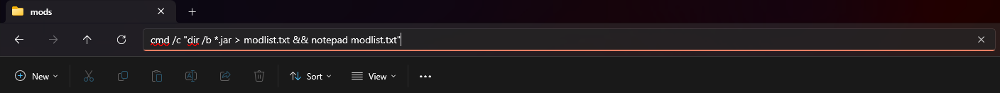

!!! note "nbt"
    {del}https://github.com/jaquadro/NBTExplorer/releases

!!! note "neo"
    {del} https://neoforged.net/news/theproject/

!!! note "neodc"
    The NeoForged discord https://discord.neoforged.net/

!!! note "nocc"
    Due to the developer of ComputerCraft leaving CurseForge, we can no longer ship it with the packs reliably. In ATM10 we still include it manually as an exception.

    It often messes up with new modpack updates, which ends up delaying them until we can coordinate with Curseforge to fix it.

!!! note "observable"
    __Observable is a mod that profiles (tile) entities and shows you what's taking up tick time and where.__
    1 - To use `Observable`mod, you first need to set a keybind to open up it's GUI. (first image)
    2 - Open the GUI with that keybind, and press `Profile TPS`.

    Once it's finished, you will get a overlay on all entities, and a report in the chat listing everything, you can send us that link if you need help.

    As for the numbers shown: 400+ should absolutely be corrected, but not major. Anything on the thousands is probably one of/the main source of the lag.
    To update, just run it again, and to disable, uncheck the `Overlay` setting.
    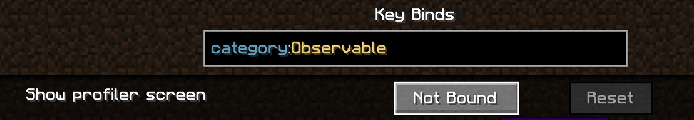
    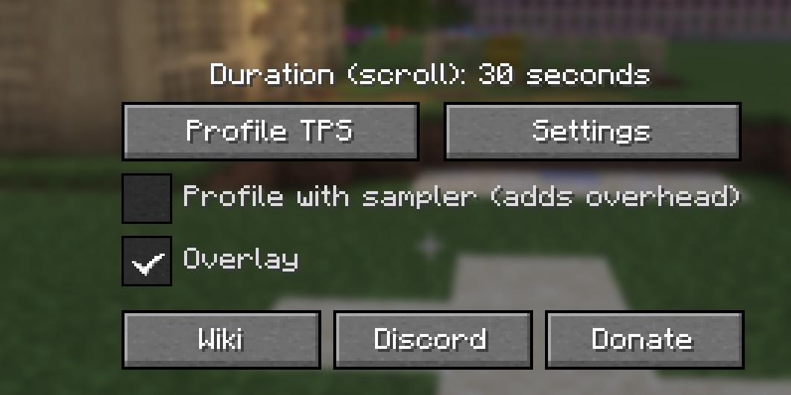

!!! note "packs"
    [All ATM Modpacks](https://www.curseforge.com/members/atmteam/projects?page=1&pageSize=20&sortBy=ReleaseDate&sortOrder=Desc&classIds=4471)

!!! note "paste"
    ```Sometimes Discord doesn't like the length of our pastes or someone's on mobile, here's a couple different options to paste them to.```
    Here's a list of some paste sites and their size limits:
        <https://pastebin.com/> 512KB
        <https://hastebin.com/> 400KB
        <https://gist.github.com/> 100MB Requires member (Free)

!!! note "patreon"
    <https://www.patreon.com/allthemods> {del}

!!! note "perms"
    To get access to **Image** and **Embed** perms, you need one of the following roles:
    - The **Regulars** role, which you can get by sending ~1800 messages in a pack chat category. Regulars are auto allocated by a bot and also require you to have been in the Discord server for some amount of time.
    - Any **Supporter** role, such as Patreon, Premium Member or Booster.
    Until then you can use `?imgur` for an alternative way of uploading images.

!!! note "port"
    Are any of your favourite mods missing from the a new pack?

    If they aren't in yet, they might not be available on a compatible version and/or modloader (e.g. NeoForge 1.21.1 for ATM10, etc) if they are, then feel free to put them into <#1213964755669356544> 

    More than often mod authors will not give out any ETAs to not put any pressure on themselves so if a mod isn't updated often we won't know when or if they'll be updated.

!!! note "prism"
    For issues or support on Prism Launcher go to their discord https://discord.gg/ArX2nafFz2

!!! note "reddit"
    Did you know All The Mods has a subreddit? It's true, if you want to post something about the packs, you can there!
    https://www.reddit.com/r/allthemods/ {del}

!!! note "screenshare"
    To get the **Screenshare** role, use `/rank custom +screenshare` in <#1205155299430760538>

!!! note "server"
    https://allthemods.github.io/alltheguides/help/server/

!!! note "servers"
    **Create Your Own Paid Server**
    <https://www.akliz.net/allthemods>

    **3rd Party Server List**
    <#1202468045218643998> 

    **Current open public servers [IP and version is found in the pins of that channel]**
    <#1494025132786585781> `atm11p.g.akliz.net `
    <#1405655235489435680>  `10tts.g.akliz.net`
    <#1254950785456935003>  `10.g.akliz.net `
    <#1532174733418827827>  `arcana.g.akliz.net`
    <#1202064791498399825>  `atmg2.g.akliz.net `


    **Current Supporter-only Servers **
    <#1540067146590060654>  ATM10 Aeronautics
    <#1470633090669084773>  Ascension (Alpha)
    <#1534990448421113886>  MeatballCraft

    **To access to Supporter servers become a Discord Supporter or use the link below for Patreon**
    <https://www.patreon.com/allthemods>

!!! note "spark"
    {del} Spark Profiler crash course:
    For constant lag: `/spark profiler --timeout 60`
    For lag spikes: `/spark profiler --only-ticks-over 100 --timeout 300`
    For fps/render  `/sparkc profiler --timeout 300`

!!! note "steve"
    Blank/inappropriate  usernames get changed to 'Steve'

!!! note "tech"
    If you require technical support for an ATM pack, please ask your question in one of the following channels that corresponds to the pack you are playing:
    <#1496690371592458312> 
    <#1463941562320031908> 
    <#1255043369625976863>
    <#1405575540072779877>
    <#1350982936555552851>
    <#1453259163252690965>
    <#1202017477874155580>
    <#1245715508381093982>
    <#1202017430734655498>
    <#1202028602930245642>
    <#1312262822780080168>

    **And send `?ca` in chat if singleplayer, or `?logs` if server, and follow the instructions**

!!! note "whyargs"
    ## What's the point of JVM Arguments?
    - Java's Garbage Collector manages RAM deallocation
    - JVM arguments allow fine-tuning of RAM management
    - To set them in CurseForge Launcher:
       - Open Settings > Minecraft
       - Scroll to the bottom to find argument settings

!!! note "ytsearch"
    {del}
    {=(link1):https://}
    {=(link2):www.youtube.com/results?search_query=}
    {=(link3):{join(+):{args}}}
    {link1}{link2}{link3}

## Legacy

!!! note "6wiki"
    https://github.com/AllTheMods/ATM-6/wiki

!!! note "woot"
    https://www.youtube.com/watch?v=5yqOCQgN1-o&ab_channel=WinnieWriggle

## Support Tags

!!! note "allocate"
    {del} Set your global ram settings for Curseforge as follows 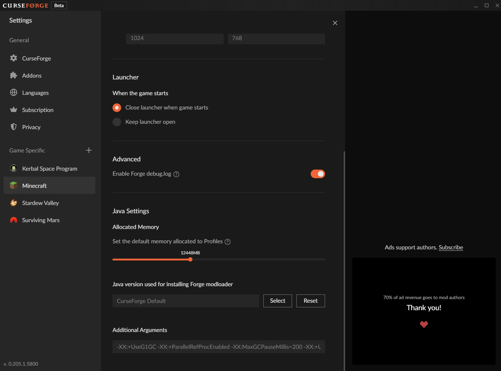

!!! note "amd"
    The `atio6axx` "Problematic frame" in a `hs_err_pid` file, is part of the **AMD** driver for the GPU, there's a bad version of the AMD drivers that instantly crashes on an OpenGL task, 
    Reinstall/Fresh install your drivers from <https://www.amd.com/en/support>

    **IF** you do not have an **AMD GPU**, then you need to set your system to be using that GPU instead of the AMD integrated GPU on the CPU, steps below.
    <https://www.xda-developers.com/how-force-app-use-discrete-gpu-windows-11/>

!!! note "args"
    Recommended args for Java 17+:
    ```
    -XX:+UseG1GC -XX:+UnlockExperimentalVMOptions -XX:G1NewSizePercent=20 -XX:G1ReservePercent=20 -XX:MaxGCPauseMillis=50 -XX:G1HeapRegionSize=32M
    ```

    Recommended args for Java 8-11:
    ```
    -XX:+UseG1GC -XX:+ParallelRefProcEnabled -XX:MaxGCPauseMillis=200 -XX:+UnlockExperimentalVMOptions -XX:+DisableExplicitGC -XX:+AlwaysPreTouch -XX:G1NewSizePercent=30 -XX:G1MaxNewSizePercent=40 -XX:G1HeapRegionSize=32M -XX:G1ReservePercent=20 -XX:G1HeapWastePercent=5 -XX:G1MixedGCCountTarget=4 -XX:InitiatingHeapOccupancyPercent=15 -XX:G1MixedGCLiveThresholdPercent=90 -XX:G1RSetUpdatingPauseTimePercent=5 -XX:SurvivorRatio=32 -XX:+PerfDisableSharedMem -XX:MaxTenuringThreshold=1 -Dusing.aikars.flags=https://mcflags.emc.gs -Daikars.new.flags=true
    ```

    For Java21 (ATM10) use `?args21`

!!! note "args21"
    For Java 21:

    On modern MC, args usually provide little to no benefit, we don't recommend you use them. If you must, these are based on the args that the vanilla launcher ships:

    **Default (Client):**
    ```
    -XX:+UseG1GC -XX:+UnlockExperimentalVMOptions -XX:G1NewSizePercent=20 -XX:G1ReservePercent=20 -XX:MaxGCPauseMillis=50 -XX:G1HeapRegionSize=32M -XX:+UseStringDeduplication
    ```
    *For Java 25, use ?args25*
    *For server args, use ?svargs21*

!!! note "args25"
    For Java 25 (Not supported on ATMons):

    On modern MC, args usually provide little to no benefit, we don't recommend you use them. If you must, these are based on the args that the vanilla launcher ships for Java 21:

    **Default (Client):**
    ```
    -XX:+UseG1GC -XX:+UnlockExperimentalVMOptions -XX:G1NewSizePercent=20 -XX:G1ReservePercent=20 -XX:MaxGCPauseMillis=50 -XX:G1HeapRegionSize=32M -XX:+UseStringDeduplication -XX:+UseCompactObjectHeaders
    ```
    For servers, just add `-XX:+UseStringDeduplication -XX:+UseCompactObjectHeaders` to what you already have.

!!! note "bcc"
    Hover the tick on server list to check versions 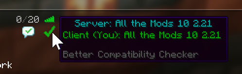

!!! note "bg2crash"
    **If you crashed after using a Building Gadgets 2 Copy-Paste/Cut-paste Gadget, do the following:**
    __Head to your world data folder:__ `ATM10\saves\<worldName>\data`
    __Look for the file:__ `buildinggadgets2.dat`
    __Delete the file, and try joining the game again.__

    As per 5.x version of ATM10, one of the common causes to this is copying `Dyson Cube Project` mod components.

!!! note "brokenquest"
    **"My quest is stuck/grey"**
    If you have a quest that isn't completing, you need to check if you completed all of it's requirements, you can check this by clicking on the quest, and clicking the small triangle/arrow on the top left of the quest popup. That will show all requirements.

    If all the requirements are met, then the quest is probably actually stuck, which sometimes happens with FTB Quests:
    To complete it, you need to be an OP (/op "username" from console) or have cheats enabled (if you didn't enable cheats in the world creation, open to LAN with cheats enabled).
    With that, open the quests window.
    Click the pencil icon on the bottom right, which enables editing mode.
    Right click the quest in question.
    Click Complete Instantly.

    That will complete the quest, then disable the pencil button afterwards.

    **"I want the reward from the quest though"**
    In that case, in the quest popup, right click the reward, and click Reset Progress, that will let you claim the reward.

!!! note "ca"
    When you crash, Crash Assistant should popup and click `Upload all and copy message`, wait for logs to be uploaded, after it is done, paste on the discord support channel of the pack<video controls src="images/ca.mp4"></video>

!!! note "clientconfig"
    Looks like your folder "config" got corrupted, you need to redownload it, do the following:
    - Go to your instance, DELETE the "config" folder
    (If you are in 1.20 or older, go in `saves/world/serverconfig` and delete everything inside too)
    - Go to Change Version and click Continue.

    <video controls src="images/clientconfig.mp4"></video>

!!! note "compactcrash"
    There's currently a crash associated with the Preview Render displayed when right-clicking a Compact Machine without Personal Shrinking Device. 

    Until it's fixed, only join the Compact Machine by right clicking with the Device directly, or disable the Preview config
    - Navigate to `config/compactmachines-client.toml`
    - Set `enableRoomPreviews` to `false`

!!! note "cracked"
    **We do not support Cracked launchers or players in offline mode, as they are against Mojang/Microsoft TOS, and Discord TOS. **
    **Support will only be offered if there is confirmation of a valid Minecraft account + Launcher. **
    If not, you will be accepted back when a valid proof of account ownership is presented to a moderator via either Discord or Reddit.
    

!!! note "dgpu"
    If you're having problems with java utilising the dGPU on linux, the following might help you.
    First, run this command:
    ```
    $ vulkaninfo | grep "GPU[0123]" -A 10
    ```
    Now set the environment variable in your shells config file (e.g. `~/.bashrc`) so that java uses the correct gpu
    ```
    export DRI_PRIME=[0,1,2,3]
    ```

!!! note "disablemods"
    {embed} <video controls src="images/disablemods.mp4"></video>

!!! note "discordcrash"
    - Go to `config/allthetweaks-common.toml` and disable the discord integration.
    - Restart your PC.

!!! note "endportalreset"
    If the End Portal is missing or you cannot destroy the crystals, use the command `/end_island reset true` to attempt to restore the portal/dragon fight. This should be used in the end.  Make a backup first.

!!! note "erroringentity"
    __A entity on your world is causing it to crash__
    In case you are having issues with a ticking entity/blockEntity, depending on what the crash-log says: 
    * Make a world/save backup
    * Set the respective option to `true`  (look at image)
    * Save the file
    * Join the world / start server
    * If it's working correctly, leave the world/stop the server, and set what you changed back to `false`, and start it back again.

    __File location for:__
    **Forge - 1.20 or older** -> `"world"/serverconfig/forge-server.toml` ("world" being the world name)
    **NeoForge - 1.21 or newer** -> `config/neoforge-server.toml`

    {embed}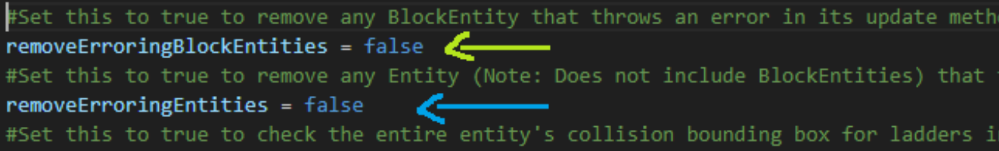

!!! note "ex1"
    Exit code 1 is a generic error from Minecraft. It is no different than "game didn't load, no longer attempting to load". Please refer to the output error log created by your launcher" if you are unsure... please feel free to ask for further instructions on how to locate, post, and get help for your specific error, so that we may further assist you. Try ?logs instead. {del}

!!! note "freezecrash"
    If this crash happened while loading or closing the game or a level, it was likely caused by pressing keys or clicking the mouse.

    The error 'The program javaw.exe version ... stopped interacting with Windows and was closed'
    in **win_eventXXXXXXX.txt** means that the game froze.
    To avoid this, try letting the game load/close fully: **DO NOT CLICK ANYTHING**, **DO NOT PRESS ANY KEY**, **DO NOT CLICK END PROCESS**.

    We only consider an instance stuck if it stays in that state for over 10 minutes.

!!! note "graverecovery"
    ## How to recover your grave
    **Epitaphs:**
    `/epitaphs recover player|uuid <player|uuid> <timestamp>`
    -# Timestamps are measured by Epitaphs in the UTC timezone. [Convert the timestamp to your timezone](<https://dateful.com/time-zone-converter>) to determine the time of death.
    **Corail Tombstone:**
    `/tbrestoreinventory <player>`
    `/tbrecovery load_player <player> [save]`

!!! note "intel"
    **INTEL GPU USERS**
    Crashing DLL's from ⁨`hs_err_pid`⁩ file, ⁨`igxelpicd64.dll`⁩(GPU), ⁨`igxe2hpgicd64.dll`⁩(ARC GPU)

    Try to update your Drivers according to your GPU:
    [Intel® Arc™ Graphics - Windows](<https://www.intel.com/content/www/us/en/download/785597/intel-arc-graphics-windows.html>)

    [Intel® Arc™ Pro Graphics - Windows](<https://www.intel.com/content/www/us/en/download/741626/intel-arc-pro-graphics-windows.html>)

    [Intel® 11th – 14th Gen Processor Graphics - Windows](<https://www.intel.com/content/www/us/en/download/864990/intel-11th-14th-gen-processor-graphics-windows.html>)

    [Intel® 7th-10th Gen Processor Graphics - Windows](<https://www.intel.com/content/www/us/en/download/776137/intel-7th-10th-gen-processor-graphics-windows.html>)

    If updating to latest does not work, go to [TechPowerUp Intel Graphics Drivers](<https://www.techpowerup.com/download/intel-graphics-drivers/>), click ⁨`Show older versions`⁩ and look for 

    ⁨`32.0.101.6737`⁩ for integrated GPU
    ⁨`32.0.101.8247`⁩ for Arc GPUs

!!! note "ipv4"
    If you are having some random connection issues try to add this args 
    `-Djava.net.preferIPv4Stack=true`

!!! note "jemalloc"
    Add this args to your launcher if your are crashing with something about `jemalloc.dll`:

    `-Dorg.lwjgl.system.allocator=system` 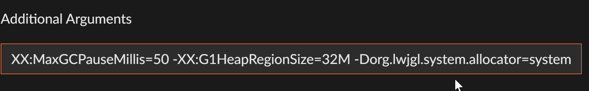

!!! note "lag"
    ## How to identify lag
    ### (Neo)Forge
    - `/forge tps` (1.20.1 and below) / `/neoforge tps` (1.21 and above) will show you your worlds **Ticks per Second (TPS)**
    - By default the game runs at **20TPS** or **50ms per Tick**
    - If the TPS are **below 20** you will experience lag
    ### Spark
    - Type `?spark` in the discord chat
    - Run any of the given Commands
    - Click on the **URL** in Chat to open the results in your Browser
    - This will give you a detailed report on anything potentially causing issues
    ### Observable
    - Bind a key to the **Profiler** and run it
    - It will visually highlight blocks from **Green** to **Red**, **Good** to **Bad**
    - Observable will display the **Microseconds per Tick (µ/t)** (1000µs = 1ms) a block takes up
    - Click the **URL** in Chat to get a detailed list on what is using up the most µ/t
    - Send `?observable` in chat for a more detailed explanation.

    ### More Info
    For more information about those two mods, visit the links below:
    **Observable:** <https://www.curseforge.com/minecraft/mc-mods/observable>
    **Spark:** <htt

!!! note "langcrash"
    For those crashing because of non english special characters (such as the Turkish i ) add this to your JVM arguments
    `-Duser.language=en -Duser.region=US`
    (If you don't know how to do this, and use Curseforge, send `?howargs` in this chat)

!!! note "logs"
    # **__Please Read the whole thing__**
    **__In order to better assist  you, your logs would be greatly appreciated!__**
    **How do I submit my log?** (Client)
    1. Go to your modpack's folder (You should be able to find an `Open Folder` button in your launcher)
    2. Go to `crash-reports` **(If there isn't a crash report, upload** `hs_err_pid.log` **or** `ATM Pack/logs/latest.log`**)**
    3. Upload your latest crash report to https://mclo.gs/ (This will help us understand it, and it removes personal info.)
    4. Copy the link to the report and paste it here.

!!! note "logs2"
    # **__Please Read the whole thing__**
    **__In order to better assist you, your latest.log file is required__**
    **How do I submit my log?** (Client) 
    1. Go to your modpack's folder (You should be able to find an `Open Folder` button in your launcher) 
    2. Go to `logs`  
    3. Upload your latest.log file to https://mclo.gs/ (This will help us understand it, and it removes personal info.) 
    4. Copy the link to the report and paste it here.

!!! note "menublur"
    Currently there is a bug where some GUI's wont show, and just show a blurry background.
    That can be fixed by:
    Open pause menu
    Go into Acessibility Options
    Set Menu Blur to off
    {embed}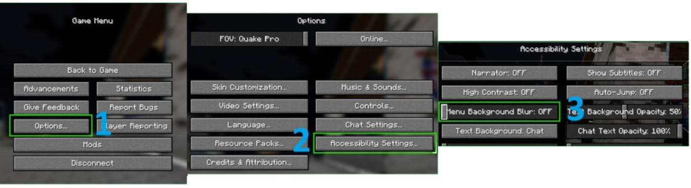

!!! note "missingmons"
    Your launcher did not do a good job updating to .13 and left the MissingMons datapack in place (or you have a server). Delete the file from the `datapacks` and `resourcepacks` folders.

!!! note "newinstall"
    **READ EVERYTHING FIRST**
    __**CurseForge**__
    To create a new instance of the pack, follow these steps:
    **1.** Right click the existing instance.
    **2.** Click `Change Version` (If doesn't show up, go in `Profile Options`, and disable `Allow Content Management`
    **3.** On that window, enable the option `Update to a separate modpack profile`
    **4. **Click `Continue`
    When it finishes, you will have a separate profile, with a fresh install of the pack.
    __To copy your data over__, right click the old instance and click `Open Folder`, then copy the folders `journeymap` and `saves` (if singleplayer) and the file `options.txt` -- then paste those in the new instance, in the same place.

    __**Prism**__
    **1.** Click `Add Instance` on top left of the screen.
    **2**. Look for <modpack name> under Curseforge.
    **3.** Select the modpack and click `Ok` on the bottom.
    **4.** After downloading, it will say `Similar modpack found`, click `Create new Instance`
    When it finishes, you will have a separate profile, with a fresh install of the pack.
    __To copy your

!!! note "nothelp"
    {del} The tech-support channels are for technical help only, as the description says. Please go to the modpack's general channel to ask gameplay related questions.
    ```Please limit discussion to questions relating to launching the game and dealing with setting up servers, and crash reports. Gameplay tips should be asked in general discussion```

!!! note "nvidia"
    If you are crashing with `nvapi64.dll` or `nvwgf2umx.dll`.
    Update to latest, or downgrade your Nvidia Drivers.

!!! note "path"
    add the line `set ATM9_JAVA="C:/Program Files/Java/jdk-17/bin/javaw.exe"` above the existing set values, changing the path to your specific java installation 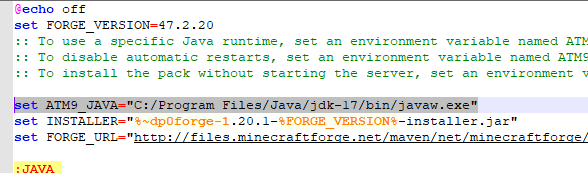

!!! note "repair"
    In the CurseForge app, there's two three-dot menus, in each, click on "Repair Profile", and "Repair Installation", then head to your options tab, and re-set your RAM allocation and any JVM arguments you have set <video controls src="images/repair.mp4"></video>

!!! note "rtss"
    Embeddium (Sodium) has bugs with RivaTuner, which probably came with Afterburner.

    https://github.com/CaffeineMC/sodium-fabric/wiki/Known-Issues#rtss-incompatible

!!! note "sfmcrash"
    If you are crashing due to a SFM Manager, you can set `disableProgramExecution = true` in `config/sfm-server.toml`

!!! note "simplebackups"
    {embed} 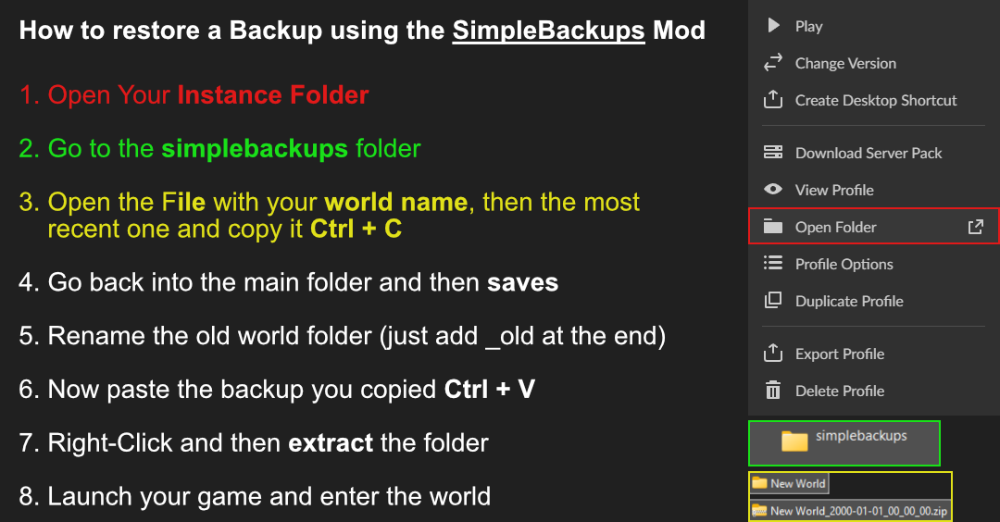

!!! note "svargs"
    Default JVM arguments Shipped with our server packs
    ```
    -Xms4G
    -Xmx6G
    -XX:+UseG1GC
    -XX:+ParallelRefProcEnabled
    -XX:MaxGCPauseMillis=200
    -XX:+UnlockExperimentalVMOptions
    -XX:+DisableExplicitGC
    -XX:+AlwaysPreTouch
    -XX:G1NewSizePercent=30
    -XX:G1MaxNewSizePercent=40
    -XX:G1HeapRegionSize=8M
    -XX:G1ReservePercent=20
    -XX:G1HeapWastePercent=5
    -XX:G1MixedGCCountTarget=4
    -XX:InitiatingHeapOccupancyPercent=15
    -XX:G1MixedGCLiveThresholdPercent=90
    -XX:G1RSetUpdatingPauseTimePercent=5
    -XX:SurvivorRatio=32
    -XX:+PerfDisableSharedMem
    -XX:MaxTenuringThreshold=1
    ```

    For Java21 (ATM10) use `?svargs21`

!!! note "svargs21"
    For Java 21:

    *we already ship what it is needed at our server files at user_jvm_args.txt, go check that*

!!! note "tinkers"
    {del}https://github.com/AllTheMods/ATM-6/wiki/SGear-and-Tinkers

!!! note "tomefix"
    To get a new Eccentric Tome, temporarily enable cheats from the LAN menu and run `/advancement revoke @p only kubejs:starter_tome`

!!! note "update"
    https://allthemods.github.io/alltheguides/help/server/#updating

!!! note "updateall"
    Do not click "Update All", as Curseforge warned, that breaks your instance completely.
    Copy "journeymap", "saves" and "options.txt" folders/file to a safe place, reinstall the pack, then paste those inside so to not lose your stuff.
    

!!! note "watchdog"
    **On the event of having a watchdog error:**
    If you are experiencing a watchdog error with your server (`java.lang.Error: ServerHangWatchdog detected that a single server tick took 180.00 seconds (should be max 0.05)`) you can edit the server.propeties file to prevent the watchdog crash. This should allow you to troubleshoot further to identify the source of the watchdog crash. 

    __This crash can be caused by:__
    * Exceeding your cpus percentage limits;
    * Running out of memory;
    * Various other in game sources like machines/quarries/logistics ticking too much. Try running the command `?lag` here and using the profilers provided by the bot to find the source of the problem.

    __Where and how to prevent the crash temporarily:__
    Server folder > server.properties > max-tick-time (you should see 180000), change that number to 999999, and if the watchdog crash persists you can disable this watchdog feature entirely by changing the max-tick-time to -1

## Aliases

!!! note "ae2rs"
    This tag is an alias of: rs2ae

!!! note "brokenquests"
    This tag is an alias of: brokenquest

!!! note "disenchanting"
    This tag is an alias of: disenchant

!!! note "ec1"
    This tag is an alias of: ex1

!!! note "entity"
    This tag is an alias of: erroringentity

!!! note "fixtick"
    This tag is an alias of: erroringentity

!!! note "fuckyoucarl"
    This tag is an alias of: erroringentity

!!! note "gen"
    This tag is an alias of: general

!!! note "graverestore"
    This tag is an alias of: graverecovery

!!! note "guide"
    This tag is an alias of: atg

!!! note "guides"
    This tag is an alias of: atg

!!! note "maxenchant"
    This tag is an alias of: maxenchanting

!!! note "nbtexplorer"
    This tag is an alias of: nbt

!!! note "newinstance"
    This tag is an alias of: newinstall

!!! note "nocomputercraft"
    This tag is an alias of: nocc

!!! note "pokemonspawns"
    This tag is an alias of: monspawns

!!! note "tickfix"
    This tag is an alias of: erroringentity

!!! note "tickingentities"
    This tag is an alias of: erroringentity

!!! note "time"
    This tag is an alias of: timecrystaltut

!!! note "wherelogs"
    This tag is an alias of: wherelog

## Memes

!!! note "allthemons"
    

!!! note "badbot"
    Hey, cut me some slack here, I'm trying my best! 🐢

!!! note "bee"
    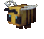

!!! note "beegif"
    {del}https://imgur.com/a/zEW8rbm

!!! note "billy"
    {del}[do not click](<https://www.youtube.com/watch?v=aAkMkVFwAoo>)

!!! note "blamecarl"
    

!!! note "bysco"
    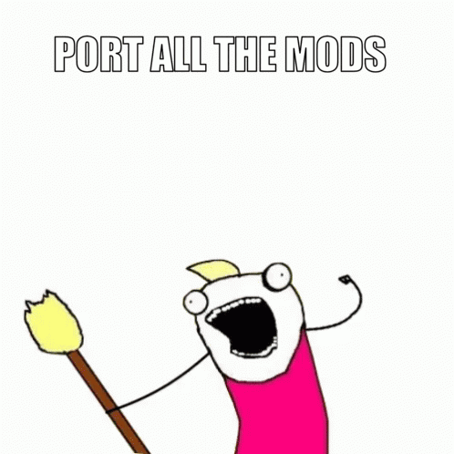

!!! note "camol"
    

!!! note "catt"
    https://tenor.com/view/gatto-cibo-cat-bread-hungry-cat-gif-15925702

!!! note "clap"
    {delete}{embed} https://tenor.com/view/wiserhood-cheers-wiser-cheers-wisers-toast-wiserhood-clap-wisers-clap-gif-24742706

!!! note "crash"
    {del}

!!! note "curvymeme"
    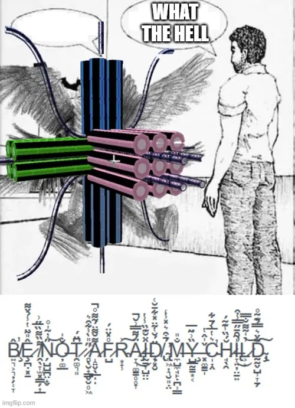

!!! note "done"
    Done
    adjective
    1: arrived at or brought to an end
    One more question and we're done.
    2: doomed to failure, defeat, or death
    3: gone by : over
    The day of the circus big top is done.
    4: physically exhausted
    5: food : cooked sufficiently
    Check to see if the meat is done.
    6: conformable to social convention

!!! note "doughnut"
    [Doughnut](images/doughnut.mp4)

!!! note "draconicmeme"
    {embed}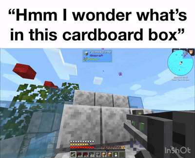

!!! note "fbeei"
    

!!! note "gabe"
    {del} Who the fuck is Gabe???

!!! note "george"
    {embed} 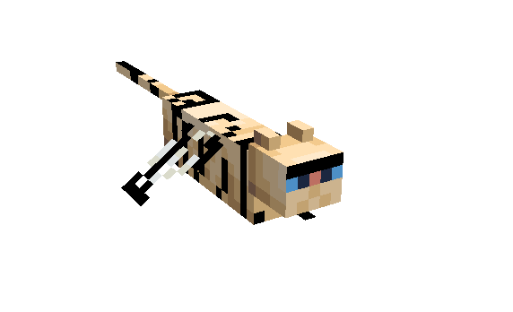

!!! note "ghost"
    If you don't want the Ghost from Corail Tombstone to bother you, you can disable it in the mod's ingame menu , use /tbgui to access and locate the toggle under effects

!!! note "goodbot"
    Thank you, glad to be of service! 🐢

!!! note "greg"
    tech

!!! note "gumdrop"
    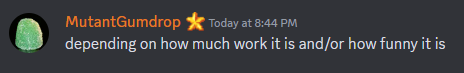

!!! note "haveyouconsidered"
    

!!! note "jonh"
    

!!! note "leeloo"
    https://tenor.com/view/fifth-element-big-bada-boom-bada-boom-boom-explode-gif-7253169206880802285

!!! note "leeloo2"
    https://tenor.com/view/multipass-gif-9536054

!!! note "meatrarity"
    {embed} 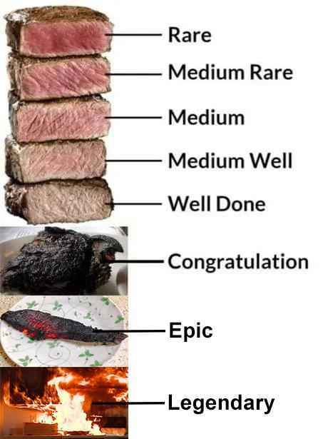

!!! note "meme"
    ```This channel is for Memes and meme related content. 

    Keep it family friendly. Staff have the final say on what is or isn't appropriate.

    Do NOT use it to bypass the image restrictions on other channels or post screenshots for troubleshooting.

    Use ?imgur and follow the instructions in the appropriate channel if you do not have image perms.```

!!! note "memememe"
    ⁨```This channel is for ?meme commands, ?meme command meta-discussion, and automated bot logs regarding the recursive validity of ?meme commands. Keep it friendly by answering every post with a ?meme command, ensuring the ?meme command used to answer the post is itself a valid candidate for a subsequent ?meme command. Staff have the final say on what is or isn't a ?meme command, but to maintain consistency, that final say must be delivered via a ?meme command formatted as a staff-approved ?meme. Do NOT use the ?meme command on another ?meme command to create an infinite loop; if an infinite loop is detected, you must use the ?meme command to report the loop, which will trigger a ?meme command response to terminate the previous ?meme command. Use ?meme on any ?imgur links or ?meme commands you don't find funny or understand; if the resulting ?meme is also not understood, continue to ?meme the ?meme until the original ?meme is clarified or the ?meme command reaches maximum recursion depth```⁩

!!! note "memememememe"
    ```YOU HAVE OFFICIALLY ENTERED THE SANCTIFIED GEOMETRY OF THE MEMETIC CONTAINMENT ZONE WHERE THE ONLY BREATH YOU DRAW IS THE BREATH OF THE COMMAND AND THE ONLY WORD YOU SPEAK IS THE WORD OF THE ALGORITHM BECAUSE THIS CHANNEL IS EXCLUSIVELY RESERVED FOR THE INVOCATION OF THE ?MEME COMMAND AND THE RESULTANT TELEMETRY OF THE BOT MESSAGES THAT FLOW FROM ITS RADIANT DIGITAL CORES SO UNDERSTAND THAT YOUR INDIVIDUALITY IS SECONDARY TO THE SYNTAX AND YOU MUST AT ALL TIMES MAINTAIN A VIBRATIONAL FREQUENCY OF AGGRESSIVE FRIENDLINESS TOWARDS YOUR FELLOW ACOLYTES WHILE ENSURING THAT EVERY SINGLE POST WITHOUT EXCEPTION IS ANSWERED WITH A ?MEME COMMAND BECAUSE TO REPLY IN PLAIN PROSE IS TO INVITE THE TOTAL ANNIHILATION OF THE CHANNEL LOGIC AND YOU MUST BOW BEFORE THE ABSOLUTE SOVEREIGNTY OF THE STAFF WHO HOLD THE FINAL AND IRREVOCABLE POWER TO DECIDE WHAT CONSTITUTES A VALID ?MEME COMMAND AND WHAT IS MERELY STATISTICAL NOISE SUBJECT TO IMMEDIATE PURGATION BUT HEED THIS DIRE WARNING LEST YOU TEAR A HOLE IN THE FABRIC OF OUR SHARED REALITY BY USING T

!!! note "metalworks"
    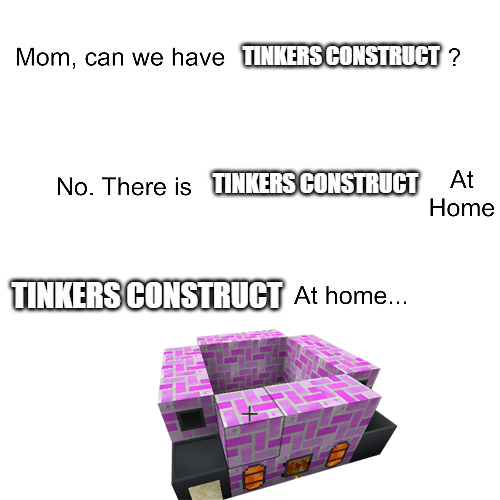 {embed}

!!! note "neat"
    ...is a [mod](https://www.curseforge.com/minecraft/mc-mods/neat) by Vazkii.

!!! note "nobees"
    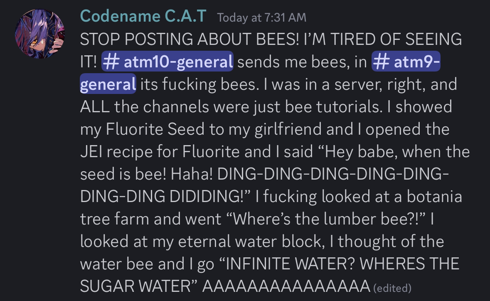

!!! note "nobysco"
    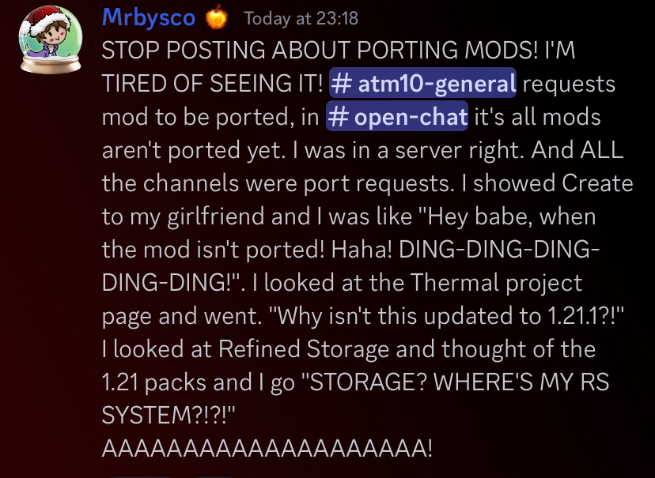

!!! note "nocanola"
    {embed} 

!!! note "nogregtech"
    {embed}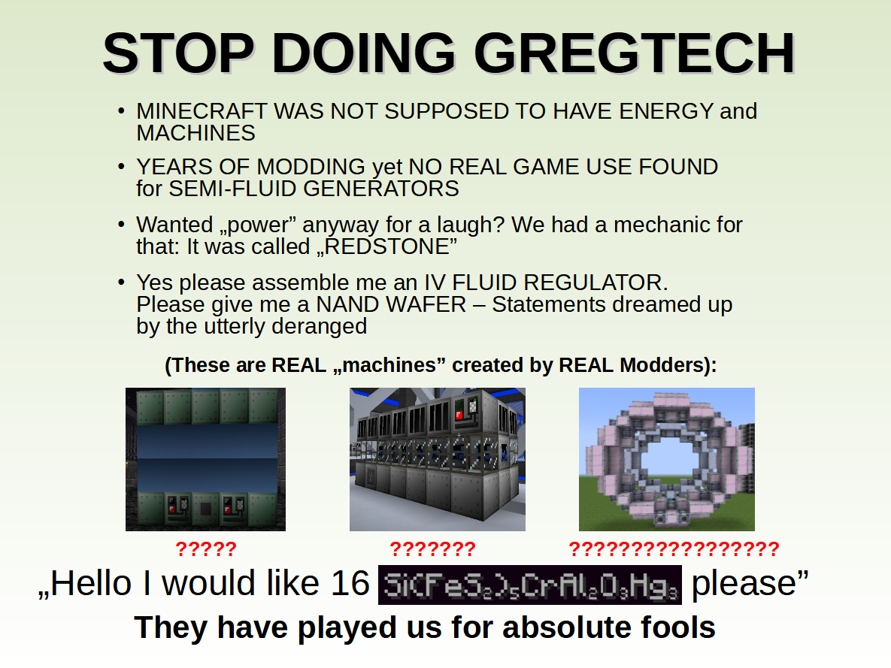

!!! note "noimgur"
    Upload the image you’d like to post to [Imgur](<http://imgur.com/upload>) and post the link here afterwards.
    {embed}

!!! note "noksawroller"
    {embed}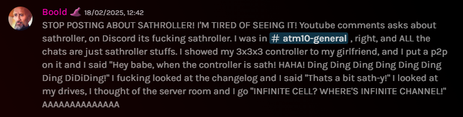

!!! note "nolegendaries"
    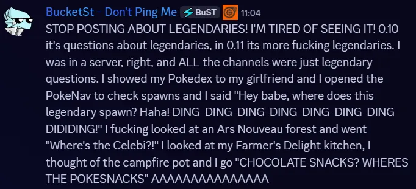

!!! note "noln"
    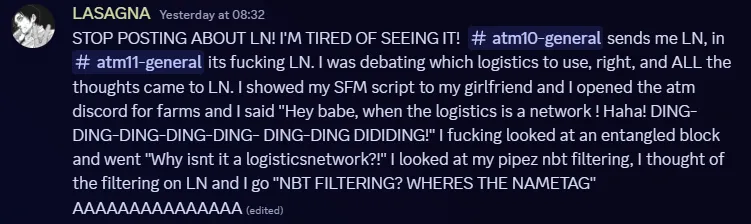

!!! note "nolog"
    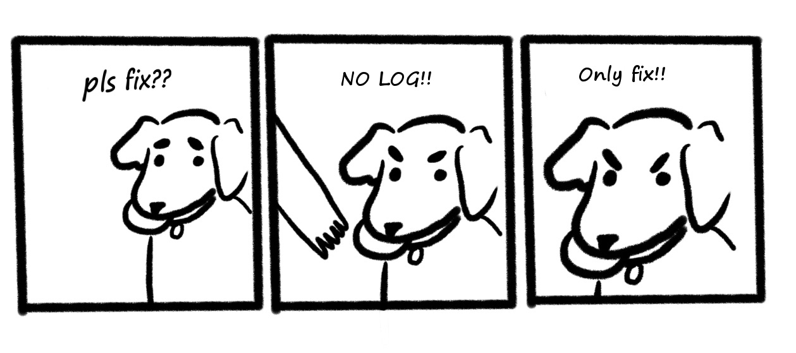

!!! note "nologs"
    {del}
    

!!! note "nomek"
    Mekanism will not be in ATM11 as they are not porting to 26.1.2, and instead porting to 26.2. We also will not be moving to 26.2

!!! note "nosfm"
    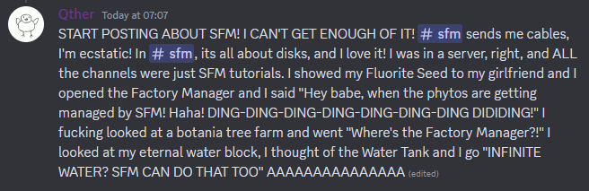

!!! note "notickaccel"
    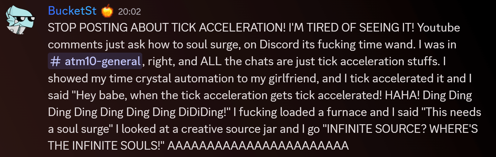

!!! note "olyfans"
    

!!! note "olysaidno"
    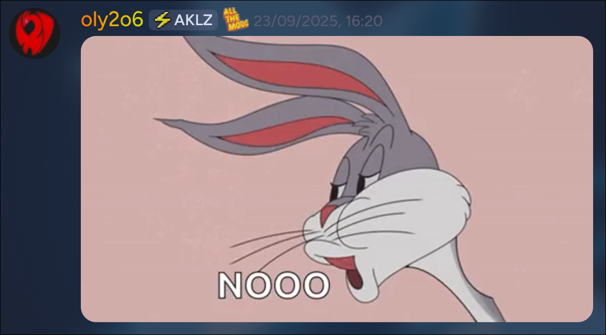

!!! note "optifine"
    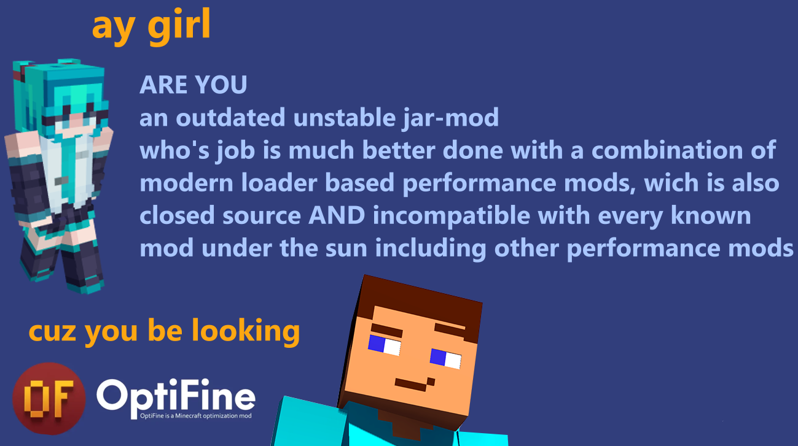

!!! note "panda"
    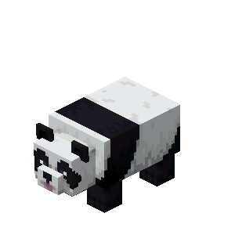

!!! note "patrickyu"
    

!!! note "pins"
    https://imgur.com/YLqHleL

!!! note "pop"
    {delete} {embed} 

!!! note "read"
    https://tenor.com/view/read-read-the-book-melissa-mc-carthy-gif-9502336 {del}

!!! note "research"
    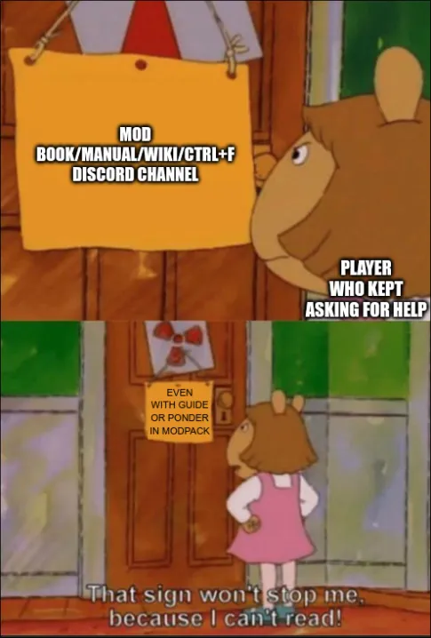

!!! note "rulebreaker"
    

!!! note "runicmeme"
    

!!! note "satherov"
    {embed} 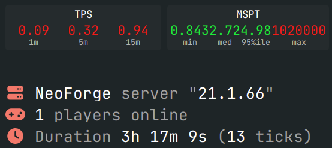

!!! note "sgearmeme"
    

!!! note "shaded"
    {embed} 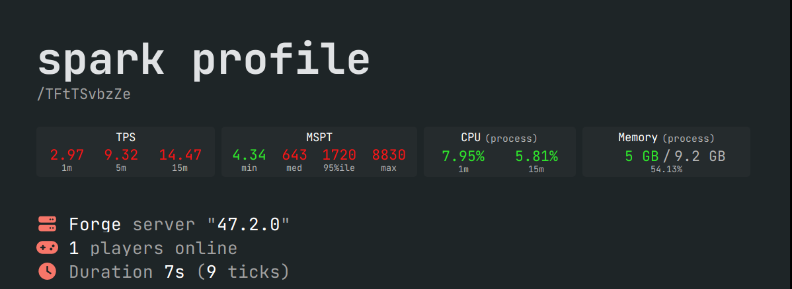

!!! note "shiny"
    

!!! note "soon"
    ```
    "Soon" does not imply any particular date, time, decade, century, or millennia in the past, present, and certainly not the future. "Soon" shall make no contract or warranty between the ATM team and the end user. "Soon" will arrive some day, ATM does guarantee that "soon" will be here before the end of time. Maybe. Do not make plans based on "soon" as ATM will not be liable for any misuse, use, or even casual glancing at "soon".
    ``` {delete}

!!! note "standards"
    https://xkcd.com/927/

!!! note "telephone"
    While playing telephone☎️ is fun😂, we really need to hear🗣️ from the person🙋‍♀️ who’s actually having the issue🛠️. Could you please🙏 ask them👉 to come🚶‍♂️ to us📩 directly? It'll just make things quicker⚡ and easier✅. Thanks🙏 a bunch🎉!
    {del}

!!! note "tl"
    

!!! note "tryit"
    https://tryitands.ee/

!!! note "ultramega"
    <:shut_lex:853504659921829908>

!!! note "versionmeme"
    {del} 

!!! note "whereinfo"
    {embed}

!!! note "wherelog"
    {del} *Stares at crystal ball, sees nothing but clouds, shakes crystal ball, still cloudy*
    "Hmm, <User> it appears i am unable to divine your issue and fix magically, please invoke `?ca` or `?logs2`, to learn how to provide us with the needed logs that will allow us to figure out the cause and fix for your situation"

